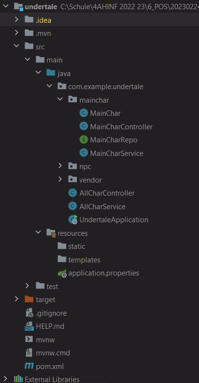
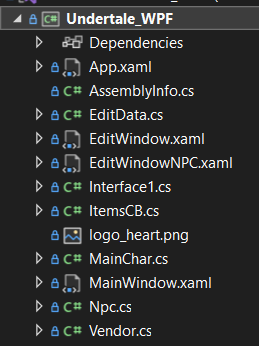
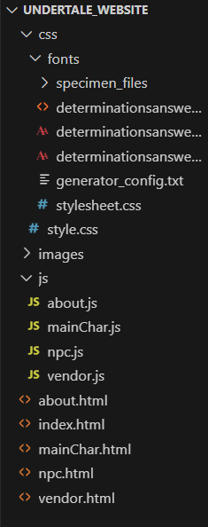

# Project - Undertale Character List 
> **DISCLAIMER:** This entire project was intended and is used as a school project. Everything having a connection to the game "UNDERTALE" belongs to Toby Fox.
## 1) What is "UNDERTALE"?
"Undertale" is a RPG-like game where you play as a human who has fallen into a deep hole and woke up in an underground world full of monsters. 

As the main protagonist you have the power to either kill and destroy every living being in the underground, which rewards you with LV (it usually stands for LEVEL, but the main antagonist calls it "LOVE" to confuse the player) and G (short for GOLD / it is used as the currency of the game), or spare everyone, make friends with many different monsters and escape the underground together. 
> For more information visit the official Undertale Website [here](https://undertale.com/) (created by Toby Fox). 

## 2) What is this project about?
### 2.1) Description
Undertale has many different and unique characters. Doesn't matter if they are a main character, a NPC (Non Playable Character) or just a dog. This project collects and stores every single character along with their many abilities, features and attributes into a list, so the user can view them without the need to play the game. 

### 2.2) Functionality
The user should also be able to add, edit, delete and view different characters using a WPF application and a Website.
> **Note:** because of time problems and the underestimated project size the *Website* can *only display* the characters.

## 3) How does the Software look like?
### 3.1) Spring Boot API
<u>*Programming language:*</u> Java (Maven)
<u>*Operations:*</u> Manages Add / Edit / Delete / View Requests
<u>*Dependencies:*</u> Spring Data MongoDB / Spring Boot Actuator / Spring Data JPA / Spring Web

#### 3.1.1) Functionality
The API acts like a connector between the application in the Frontend and the MongoDB database in the Backend. The application sends requests in the form of HTTP-Requests using a path (used for connecting to the different collections) and the request method (GET --> View / POST --> Add / PUT --> Edit / DELETE --> Delete) attached to it. 

#### 3.1.2) Structure:

This project has 3 different types of characters. Every single one has it's own Java Class, Controller, Repository and Service. In the *pom.xml* are all of the dependencies located the API needs to work correctly. The *application.properties* is used for changing the port of the API and also for specifying the MongoDB Atlas connection string.<br>
> **Note:** The "AllCharController" and "AllCharService" are working but aren't used in any application

**Main Character:**
<br>
**MainChar.cs:**
```java
@Document(collection = "mainCharacters")  
public class MainChar {  
  @MongoId  
  private String id;  
  private String name;  
  private List<String> appearances;  
  private String role;  
  private String status;  
  private int maxHealth;  
  private Map<String, Ability> abilities;  
  
  public MainChar() {  
  
 }
...
```
With the annotation *"@Document(collection = mainCharacter)"*, the API knows where the data of the document is stored. Every main character also gets the internal ID from MongoDB *("@MongoId")*. For every attribute exists a getter and setter below the Constructors. The Ability item, that is stored in the dictionary, is defined in the same class.
<br>
```java
...
public static class Ability {  
  private String name;  
  private List<String> features;  
  
  // GETTER AND SETTER
  public String getName() { return name; }  
  public void setName(String name) { this.name = name; }  
  public List<String> getFeatures() { return features; }  
  public void setFeatures(List<String> features) { this.features = features; }
}
...
```
Every Ability has a name and a list of features. This class exists inside MainChar.cs.
<br><br>
**MainCharRepo.cs:**
```java
@RepositoryRestResource(collectionResourceRel = "mainCharacters", path = "char/mainChar")  
public interface MainCharRepo extends MongoRepository<MainChar, String> {  
  List<MainChar> findByName(@Param("name") String name);  
}
```
All of the main characters get saved in this Repository. The collection *(where the items are stored in the database)* and path *(the same as in the Controller)* need to be specified. Instead of "findById()" I changed it so the API finds the item by the name.
<br><br>
 **MainCharService.cs:**
```java
@Service  
public class MainCharService {  
  @Autowired  
  private MainCharRepo mainCharRepo;  
  
  public List<MainChar> getAllMainChars() {  
    System.out.println(this.mainCharRepo.findAll());  
    return (List<MainChar>) this.mainCharRepo.findAll();  
  }  
  public List<MainChar> getMainChar(String name) { 
    return this.mainCharRepo.findByName(name); 
  }  
  
  public void addMainChar(MainChar mainChar) {  
    this.mainCharRepo.save(mainChar);  
  }  
  public void updateMainChar(String id, MainChar mainChar) {  
    this.mainCharRepo.save(mainChar);  
  }  
  public void deleteMainChar(String id) {  
    this.mainCharRepo.deleteById(id);  
  }
}
```
The "@Service"-Annotation is used for identifying what class should be used as the Service. This service passes the different actions on to the repository, which then carries out the actions using the integrated *MongoRepository* class. 
<br><br>
**MainCharController.cs:**
```java
@RestController  
@RequestMapping("/char/mainChar")  
public class MainCharController {  
  @RequestMapping("/home")  
  public String serviceTest() { return "Das Service funktioniert!"; }
  
  @Autowired  
  private MainCharService mainCharService;  
  
  // VIEW
  @GetMapping("")  
  public List<MainChar> getAllMainChars() {  
    return mainCharService.getAllMainChars();  
  }
    
  // VIEW A SPECIFIC CHARACTER  
  @GetMapping("/{name}")  
  public List<MainChar> getMainChar(@PathVariable String name) { 
    return mainCharService.getMainChar(name); 
  }  
  
  // ADD 
  @PostMapping("")  
  public String addMainChar(@RequestBody MainChar mainChar) {  
    mainCharService.addMainChar(mainChar);  
    String response = "{\"success\": true, \"message\": Main Character has been added successfully.}";  
    return response;  
  }
    
  // UPDATE  
  @PutMapping("/{id}")  
  public String updateMainChar(@RequestBody MainChar mainChar, @PathVariable String id) {  
    mainCharService.updateMainChar(id, mainChar);  
    String response = "{\"success\": true, \"message\": Main Character has been updated successfully.}";  
    return response;  
  }  
  
  // DELETE
  @DeleteMapping("/{id}")  
  public String deleteMainChar(@PathVariable String id) {  
    mainCharService.deleteMainChar(id);  
    String response = "{\"success\": true, \"message\": Main Character has been deleted successfully.}";  
    return response;  
  }
}
```
The "@RestController"-Annotation is used for identifying what class should be used as the Controller. If the "@RequestMapping"-annotation is used for the entire class, the API only accepts requests for this Controller if the path is *"localhost:< port >/char/mainChar ..."*. Every other path required for viewing, editing, deleting and adding, specified in the different "@...Mapping(" ")"-annotations are getting added to the current path and are not a stand-alone path. If the user wants to get a specific item with the name *"Hugo"* the HTTP-Request path should look something like this: **localhost:8080/char/mainChar/Hugo**
<br>
<br>
**NPC:**<br>
**Npc.cs:**
```java
@Document(collection = "npc")  
public class Npc {  
  @MongoId  
  private String id;  
  private String name;  
  private List<String> appearances;  
  private String role;  
  private String status;  
  private int maxHealth;  
  private int attack;  
  private int defense;  
  
  public Npc() {  
  }
...
```
With the annotation *"@Document(collection = "npc")"*, the API knows where the data of the document is stored. Every NPC also gets the internal ID from MongoDB *("@MongoId")*. For every attribute exists a getter and setter below the Constructors.
<br>
<br>
**Vendor:**<br>
**Vendor.cs:**
```java
@Document(collection = "vendors")  
public class Vendor {  
  @MongoId  
  private String id;  
  private String name;  
  private List<String> appearances;  
  private String role;  
  private String status;  
  private List<String> wares;  
  private Map<String, Feature> features;  
  
  public Vendor() {  
  }
...
```
With the annotation *"@Document(collection = "vendors")"*, the API knows where the data of the document is stored. Every vendor also gets the internal ID from MongoDB *("@MongoId")*. For every attribute exists a getter and setter below the Constructors.

> This project uses 3 different character types. 
> The only things getting changed for the other classes are the attributes of the items and also the names of the Controller, Service and Repositories. Also the HTTP-request paths get changed from *".../char/mainChar"* to *".../char/npc"* and *".../char/vendor"*

### 3.2) WPF application:
<u>*Programming language:*</u> C#
<u>*Operations:*</u> Add / Edit **(not working)** / Delete / View

#### 3.2.1) Functionality 
<u>*Main Window:*</u> When the application starts, the main window pops up. There, the user can choose which characters should be viewed (Main Characters / NPCs / Vendors / ~~all three~~). If the user chooses any specific type of character they can also add a new one, using the different controls provided below the list. Every single character in the list also has it's own Delete-button, where the corresponding item gets completely deleted from the list in the application but also from the MongoDB database in the backend. 

<u>*Edit Window:*</u> If the user clicks on any item in the list twice, a new window opens. The new window is the "Edit Window" where the user can either just look at every single attribute of the character or edit different things. After they click on the SAVE-button the original values of the different attributes get overwritten by the modified values. But if the user closes the window by clicking on the X-icon in the top right corner or clicks on the RESET-button, nothing should change in the database and all of the controls should be reset to their default values.
> ~~If the option that every type of character gets shown is selected, the user **cannot add any new characters** to the list. They can still **modify and delete** existing ones though.~~
> Not sure if the "View all Character Option" gets added to the final application.
> Editing doesn't work!

#### 3.2.2) Structure

The WPF-Application consists of 2 different windows, the MainWindow and the EditWindow. There also exists 3 different classes for the different character types, similar to the classes in the API. The class *"ItemsCB.cs"* is used for the values of the ComboBox.
<br>
<br>
**MainWindow.xaml.cs:**
```C#
public MainWindow() {
	InitializeComponent();
	
	List<string> itemsAppearance = new List<string> { "Ruins", "Snowdin", "Waterfall", "Hotland", "The Core", "New Home" };
	ItemsCBAppearance = new ItemsCB(itemsAppearance);
	mainCharControls.Visibility = Visibility.Collapsed;
	npcControls.Visibility = Visibility.Collapsed;
	vendorControls.Visibility = Visibility.Collapsed;

	DataContext = this;    
}
```
Right when the Application starts the list for the options of the ComboBox gets filled and all of the controls get hidden. This changes when the user changes the selection of the radio buttons.

```C#
private async void radioBtnMain_Click(object sender, RoutedEventArgs e) {
	var response = await client.GetAsync("http://localhost:6969/char/mainChar");

	if (response.IsSuccessStatusCode) {
		var json = await response.Content.ReadAsStringAsync();
        var mainChars = JsonConvert.DeserializeObject<List<MainChar>>(json);

        if (mainChars != null) {
	        myListView.ItemsSource = mainChars;

            mainCharControls.Visibility = Visibility.Visible;
            npcControls.Visibility = Visibility.Collapsed;
            vendorControls.Visibility = Visibility.Collapsed;
        }
    }
    else
    {
        myListView.Items.Add("Couldn't get Data!");
    }
}
```
The request to the Endpoint of the API *"http://localhost:6969/char/mainChar"* gets sent. The JSON, which gets sent back, gets deserialized into a list of the type "MainChar". All of the objects then get displayed in the table in the MainWindow. When the radio button-selection changes the mainCharControls are also made visible.
> The same thing happens for every single character type, but the end of the path and the controls get changed depending on the type the user wants to get.

```C#
public async Task DeleteItem(string path, string documentId) {
	try {
		using (var client = new HttpClient()) {
			client.BaseAddress = new Uri("http://localhost:6969");

            client.DefaultRequestHeaders.Accept.Clear();
            client.DefaultRequestHeaders.Accept.Add(new MediaTypeWithQualityHeaderValue("application/json"));

            var request = new HttpRequestMessage(HttpMethod.Delete, $"/char/{path}/{documentId}");
            Trace.WriteLine(documentId);
            Trace.WriteLine(request.ToString());
                  
            var response = await client.SendAsync(request);
                    
            if (response.IsSuccessStatusCode) {
	            MessageBox.Show("Character successfully deleted!", "Success", MessageBoxButton.OK, MessageBoxImage.Information);
            }
...
```
A new HttpClient gets created. The character specific Endpoint gets added to the base address *"localhost:6969"*. So it can delete the object from the database the ID also gets added to the path. The client then sends the request to the API and deletes the item from the database.

```C#
public async Task PostItemAsync(object character) {
	try {
	    using (var client = new HttpClient()) {
	        client.BaseAddress = new Uri("http://localhost:6969");

            client.DefaultRequestHeaders.Accept.Clear();
            client.DefaultRequestHeaders.Accept.Add(new MediaTypeWithQualityHeaderValue("application/json"));

            string json = JsonConvert.SerializeObject(character);
            Trace.WriteLine(json);

            var content = new StringContent(json, Encoding.UTF8, "application/json");
            var response = await client.PostAsync($"/char/{checkCharacterType()}", content);

            if (response.IsSuccessStatusCode) {
	            MessageBox.Show("Character successfully added!", "Success", MessageBoxButton.OK, MessageBoxImage.Information);
            }
...
```
The same concept as deleting a character also is used for adding an object to the database. This time the entire character object gets serialized and added to the request. Only the character type for their specific Endpoint gets added to the path. Instead of a DELETE request the WPF now sends a POST request to the API.
<br>
<br>
**EditWindow.xaml.cs:**
> This window only gets used for *main characters*. For the NPC (and in the future for the vendor) a new edit window gets created.

```C#
private void SetExistingData(MainChar mainChar) {
    nameEdit.Text = mainChar.Name;
    appearancesEditCB.SelectedItems = mainChar.Appearances;
    roleEdit.Text = mainChar.Role;
    statusEdit.Text = mainChar.Status;
    healthEdit.Text = mainChar.MaxHealth.ToString();

    abilityNameLB.Items.Clear();
    foreach (MainChar.Ability ab in mainChar.Abilities.Values) {
	    abilityNameLB.Items.Add(ab.Name);   
    }
}
```
After the window gets opened on a specific character their attributes and values get added to the different controls existing in the window.

```C#
private async Task UpdateItemAsync(MainChar mainChar) {
	using (var httpClient = new HttpClient()) {
	    httpClient.BaseAddress = new Uri("http://localhost:6969/char/mainChar");

        httpClient.DefaultRequestHeaders.Accept.Clear();
        httpClient.DefaultRequestHeaders.Accept.Add(new MediaTypeWithQualityHeaderValue("application/json"));

        var json = JsonConvert.SerializeObject(mainChar);

        var response = await httpClient.PutAsync($"/{mainChar.Id}", new StringContent(json, Encoding.UTF8, "application/json"));
        response.EnsureSuccessStatusCode();
	}
}
```
The update function works similar to the other requests. The BaseAdress to the API gets created and the object, the user wants to add, gets serialized. After that a PUT request with the character ID gets sent to the API.
> This doesn't work for some reason!

### 3.3) Website
<u>*Programming Language(s):*</u> HTML; CSS; JavaScript
<u>*Operations:*</u> View

#### 3.3.1) Functionality
After the server is started (locally) the user should be able to access the Website via "http://localhost:5500". It should automatically route to the "Home" of the website. There the user can switch between what characters they want to see using the buttons located in the navbar. If they click on any character, the corresponding HTML-File gets opened where every single attribute of the characters get displayed.

#### 3.3.2) Structure

The Website consists of different HTML-files (index.html + about.html + a file for every character type), a style.css and many different JavaScript-files, which are being used for showing the character information. A custom font, that was also used in the official game, got added to the project.
<br>
<br>
**mainChar.js:**
```javascript
const apiUrl = 'http://localhost:6969/char/mainChar';

const getMainCharacters = async () => {
	try {
		const response = await fetch(apiUrl);
		const data = await response.json();
		
		const charactersContainer = document.getElementById('character-card');
		let charactersHTML = '';
		
		data.forEach(character => {
			console.log(character.name);
			const card = createCharacterCard(character);
			charactersHTML += card;
		});
		charactersContainer.innerHTML = charactersHTML;
	} catch (error) {
		console.error(error);
	}
};
```
This function sends a get request to the API and displays the data on the website in the div with the ID "character-card". For each character gotten from the database a seperate character card gets created and added to the div.

```javascript
const createCharacterCard = (character) => {
	console.log(character);
	var text =
	`<div class="card">
		<h2 class="card-title">${character.name}</h2>
		<div class="card-info">
			<p><u>Appearances:</u> <span class="appearances"><br>${character.appearances.join(', ')}</span></p>
			<p><u>Role:</u> <span class="role"><br>${character.role}</span></p>
			<p><u>Status:</u> <span class="status"><br>${character.status}</span></p>
			<p><u>Max Health:</u> <span class="max-health"><br>${character.maxHealth}</span></p>
			<h3>Abilities:</h3>
			<ul class="abilities">
	`;

	for (let i in character.abilities) {
		text += `<li><u><span class="ability-${i+1}-name">${character.abilities[i].name}</span>:</u> <span class="ability-${i+1}-features"><br>${character.abilities[i].features.join(', ')}</span></li>`;
	}

	text +=
			`</ul>
		</div>
	</div>`
	
	return  text;
}
```
The "createCharacterCard" function gets called for every single character. This just displays every attribute of the character inside of a card. Because one character can have multiple abilities and they get added like "ability1, ability2,..." a for loop has to be used to get every single ability with it's different features.

## 4) Final Thoughts
This project was a great way to improve my skills creating a WPF-App and a Website with a connection to a database using an API. Of course, a lot of problems occurred during development and slowed down the programming process:
**API:** 
- Managing different character types
- Connecting to a MongoDB Atlas database instead of a local database

**WPF:**
- the standard WPF-Dropdown doesn't support multiple selection
- first time getting, viewing, adding, deleting and editing data in a database using a WPF-App
- editing an item in general (still doesn't work)
- viewing abilities and features at the same time using 2 ListBoxes

**Website:**
- getting and displaying the elements using the API
- importing a [custom font](https://www.fontspace.com/determination-mono-web-font-f23209)

In general, most of the things I wanted to do got done, except for some small details and the PUT-request in the WPF.

**The videogame "UNDERTALE" this project is based on, was created and belongs to Toby Fox (including all of the characters, locations and logos being used)!**
